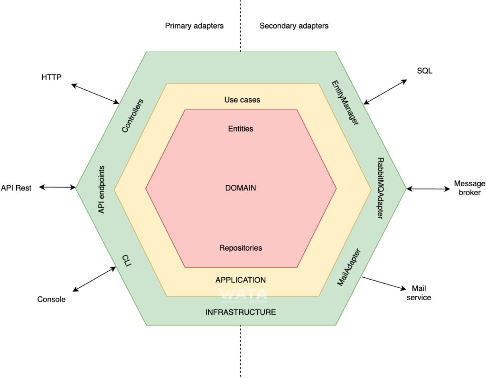

## Superheroes test by Nahuel Ariel Ojea

This project is an application that allows retrieving superhero data based on various operations.

### Hexagonal Architecture

Hexagonal architecture is a model for designing software applications, focusing on isolating domain logic from external factors.

The application is divided into three layers: application (outside), domain (inside), and infrastructure (outside):



#### Domain Layer:
Contains the business logic of the application and interfaces to communicate with external parts, such as databases.

#### Application Layer: 
Handles interactions between users or other programs and the application. Includes user interfaces.

#### Infrastructure Layer: 
Contains configurations needed for the application to work, such as database configurations and Spring configurations. Additionally, it includes RESTful controllers and JSON serialization libraries.

More information in the following link:

- [Organizing Layers Using Hexagonal Architecture, DDD, and Spring](https://www.baeldung.com/hexagonal-architecture-ddd-spring)

### Database

This project has an H2 in-memory database. We will persist the initial data for testing.

In order to access the data we must login in at the following link with the data we see in the image.

- [H2 console](http://localhost:8081/h2-console)


### Security

Spring Security was used to secure the application.

### Cache

Spring Cache was used to cache the superheroes data.

### Documentation

Project documentation was done through Swagger and OpenAPI. The requested endpoint is documented along with input and response data.

- [Swagger](http://localhost:8081/swagger-ui/index.html)


The OpenAPI maven plugin was used for the code generation

- [API-First Development with Spring Boot and Swagger](https://reflectoring.io/spring-boot-openapi/)


## Run Spring Boot application with Docker

Compile application:
```
 mvn clean install
```

Create Docker image:
```
 docker build --tag=superheroes:latest .
```

Run Docker container:

```
 docker run -p8081:8081 superheroes:latest
```

## REST Request examples

### Get superhero by id

Curl:
```
  curl -X 'GET' \
  'http://localhost:8081/superheroes/1' \
  -H 'accept: application/json'
```

Request URL:
```
http://localhost:8081/superheroes/1
```

### Get all superheroes

Curl:
```
  curl -X 'GET' \
  'http://localhost:8081/superheroes' \
  -H 'accept: application/json'
```

Request URL:
```
http://localhost:8081/superheroes
```

### Get superhero by name

Curl:
```
  curl -X 'GET' \
  'http://localhost:8081/superheroes/name/batman' \
  -H 'accept: application/json'
```

Request URL:
```
http://localhost:8081/superheroes/name/batman
```

### Create superhero

Curl:
```
  curl -X 'POST' \
  'http://localhost:8081/superheroes' \
  -H 'accept: application/json' \
  -H 'Content-Type: application/json' \
  -d '{
  "id": 20,
  "name": "Goku"
}'
```

### Update superhero

Curl:
```
  curl -X 'PUT' \
  'http://localhost:8081/superheroes' \
  -H 'accept: application/json' \
  -H 'Content-Type: application/json' \
  -d '{
  "id": 20,
  "name": "Goku SSJ2"
}'
```

### Delete superhero

Curl:
```
  curl -X 'DELETE' \
  'http://localhost:8081/superheroes/20' \
  -H 'accept: application/json'
```